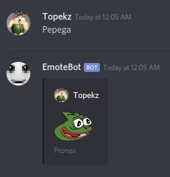

# emoteBot
Discord.js bot for Twitch emotes

--> [Add to your server!](https://discord.com/api/oauth2/authorize?client_id=628258149291261962&permissions=59392&scope=bot) <--

## Instructions
- Install [nodejs](https://nodejs.org) 12 or newer.
- Clone this repository.
- Run ``npm install`` inside the directory.
- Create a new Discord application and a bot from [here](https://discordapp.com/developers/applications).
- Create a new file named ``.env`` and add this line: ``DC_KEY=token`` where "token" is your bot's token.
- The bot can be started with: ``node emoteBot.js`` or if you're on Linux and would like to use screen: ``./startBot.sh``.

## Contributing
### Emotes
- Add your emote into the "emotes.json" file as a new line. Example: ``"<emote_name>": "<emote_link>"``.
- Make sure to have a comma after every line except the last line with an emote.
- <emote_name> is the emote keyword.
- <emote_link> is a link to the emote image. You can find emotes from FFZ's or BTTV's official sites. Copy the image location of the 2X version of the emote. If the emote is a gif, make sure to have ".gif" in the link.
- Make a pull request with your changes. :)
### Code
- Make your changes and make a pull request. I will look at it. :)
